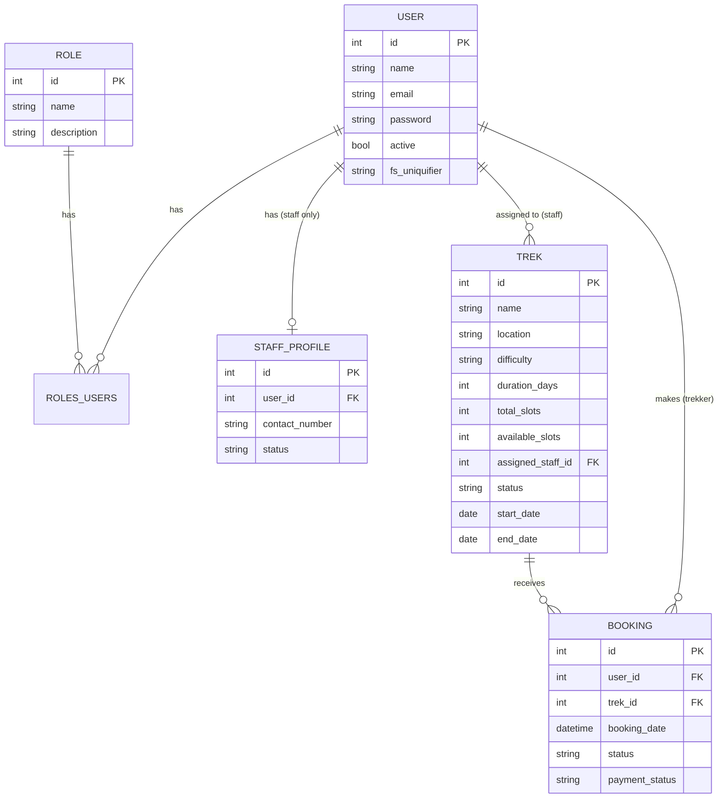
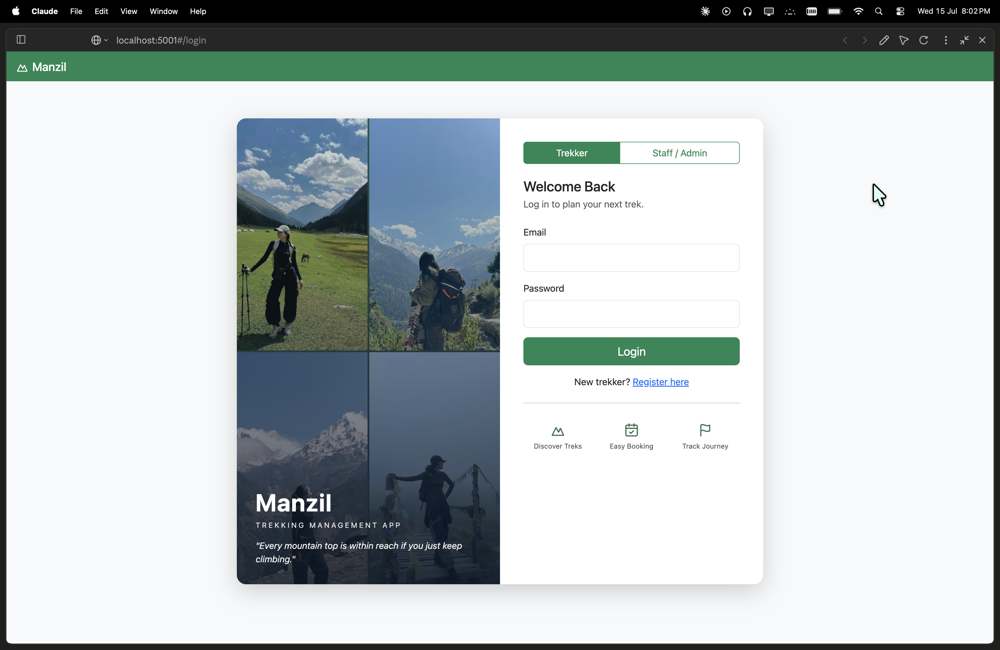
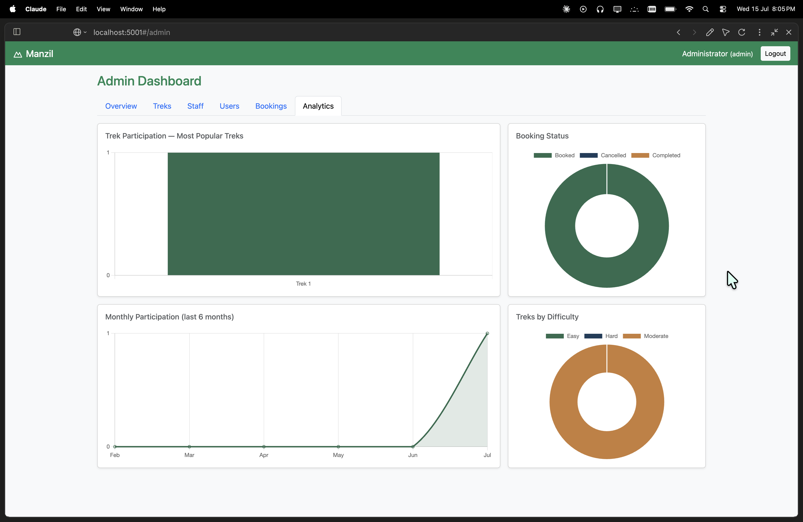
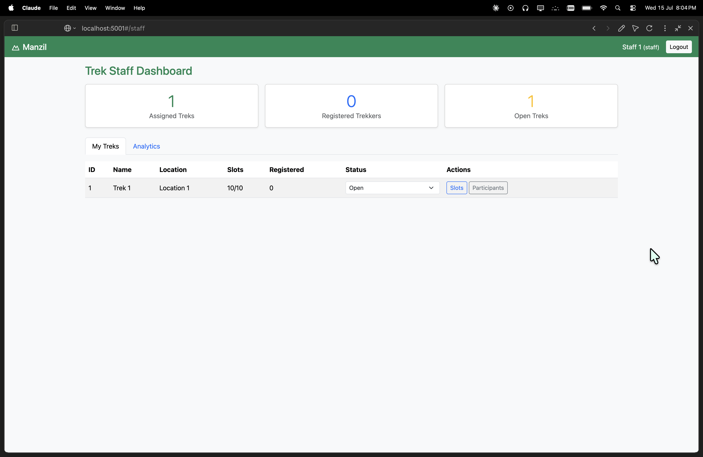
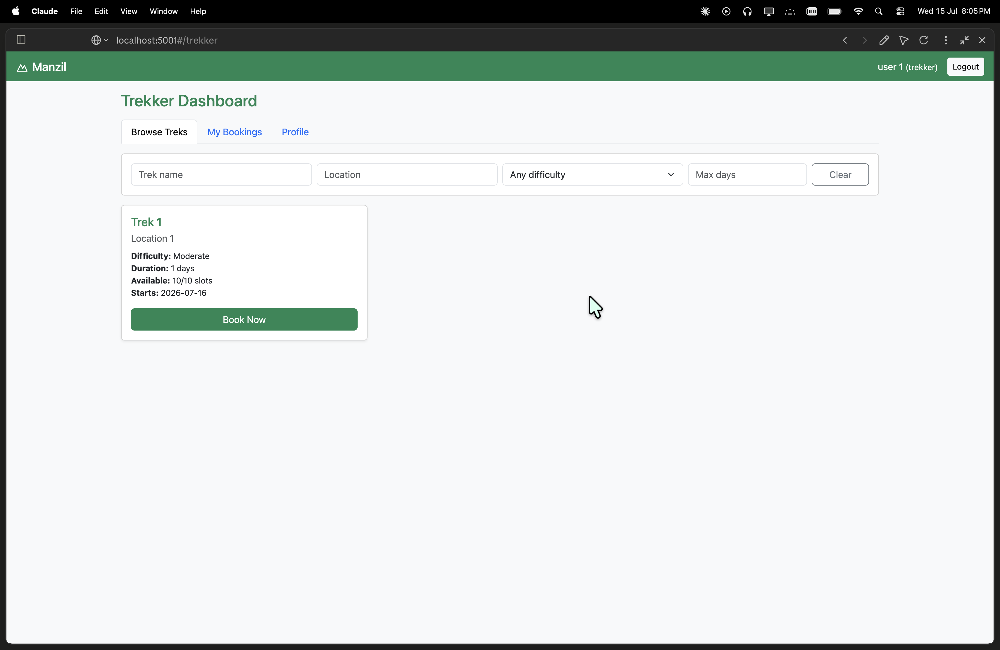

# Manzil - Trekking Management Application

MAD-II project by 23f2001500. Manzil - A role-based web app to manage trekking activities for **Admin**, **Trek Staff**, and **Trekkers (Users)**.

## Tech Stack
- **Backend:** Flask + Flask-SQLAlchemy
- **Auth:** Flask-Security-Too (token-based)
- **Frontend:** VueJS (CDN) + Bootstrap
- **Database:** SQLite
- **Caching:** Redis
- **Batch jobs:** Celery + Redis
- **Email (local):** Mailhog SMTP

## Project Structure
```
frontend/          Vue (CDN) SPA
  index.html       single Jinja2 entry point
  components/       Vue page components (.js)
  src/             store, router, app bootstrap
  img/             login-page photos (hero1..hero4.jpg)
backend/           Flask API
  app.py           app factory (serves ../frontend)
  models/          SQLAlchemy models
  routes/          API blueprints (auth, admin, staff, trekker)
  tasks.py, celery_app.py, cache.py, emailer.py, ...
  create_admin.py  seeds DB + admin
  requirements.txt
```

## Setup
```bash
python3 -m venv venv
source venv/bin/activate
pip install -r backend/requirements.txt
python backend/app.py              # auto-creates DB + admin, runs on http://localhost:5001
```

Default admin: `admin@manzil.com` / `admin123`

### Background jobs (Celery + Redis)
Requires Redis running (`redis-server`) and, for email, Mailhog (`localhost:1025`).
```bash
# in separate terminals (venv activated), from the backend/ directory:
cd backend
celery -A celery_app.celery worker --loglevel=info   # background worker
celery -A celery_app.celery beat   --loglevel=info   # scheduled jobs (daily/monthly)
```
Jobs: daily trek reminders, monthly activity report (HTML email to admin),
and user-triggered CSV export of trekking history (from the trekker dashboard).

## Database Schema (ER Diagram)



**Tables**
- **User** — unified account model for all roles (admin / staff / trekker); role stored via `roles_users`.
- **Role** — admin, staff, trekker (Flask-Security).
- **StaffProfile** — one-to-one extra details for a staff user (contact, status).
- **Trek** — a trekking event; `assigned_staff_id` → the managing staff.
- **Booking** — a trekker's booking of a trek; unique on `(user_id, trek_id)`.

**Relationships**
- User (staff) **1 — N** Trek — a staff member manages many treks (`Trek.assigned_staff_id`).
- User (trekker) **1 — N** Booking — a trekker makes many bookings.
- Trek **1 — N** Booking — a trek receives many bookings.
- User **1 — 1** StaffProfile — a staff user has one profile.
- User **N — N** Role — via `roles_users`.

## API Endpoints

**Auth** (`/api`)
| Method | Endpoint | Description |
|---|---|---|
| POST | `/api/register` | Trekker self-registration |
| POST | `/api/login` | Login (any role), returns token + role |
| POST | `/api/logout` | Invalidate current token |
| GET  | `/api/me` | Current authenticated user |

**Admin** (`/api/admin`, admin only)
| Method | Endpoint | Description |
|---|---|---|
| GET | `/api/admin/stats` | Dashboard counts |
| GET / POST | `/api/admin/treks` | List / create treks |
| PUT / DELETE | `/api/admin/treks/<id>` | Update / delete a trek |
| GET / POST | `/api/admin/staff` | List / create staff |
| GET | `/api/admin/users` | List trekkers |
| PATCH | `/api/admin/users/<id>/toggle-active` | Blacklist / restore a user |
| GET | `/api/admin/bookings` | All bookings (filter by status / search) |

**Trek Staff** (`/api/staff`, staff only — scoped to assigned treks)
| Method | Endpoint | Description |
|---|---|---|
| GET | `/api/staff/stats` | Staff dashboard counts |
| GET | `/api/staff/treks` | My assigned treks |
| GET | `/api/staff/analytics` | Analytics for my treks |
| PATCH | `/api/staff/treks/<id>/slots` | Update capacity |
| PATCH | `/api/staff/treks/<id>/status` | Open / Closed / Completed |
| GET | `/api/staff/treks/<id>/participants` | Participants of a trek |
| PATCH | `/api/staff/bookings/<id>/status` | Update a participant's booking |

**Trekker** (`/api/trekker`, trekker only)
| Method | Endpoint | Description |
|---|---|---|
| GET | `/api/trekker/treks` | Browse / filter open treks |
| GET / POST | `/api/trekker/bookings` | My bookings / book a trek |
| PATCH | `/api/trekker/bookings/<id>/cancel` | Cancel a booking |
| GET / PUT | `/api/trekker/profile` | View / update profile |
| POST | `/api/trekker/export` | Trigger async CSV export |
| GET | `/api/trekker/export/<task_id>/status` | Poll export status |
| GET | `/api/trekker/export/download/<file>` | Download the CSV |

**Public** (`/api/public`, no auth — aggregate only)
| Method | Endpoint | Description |
|---|---|---|
| GET | `/api/public/stats` | Aggregate stats for analytics charts |

## Screenshots

| Login | Admin Analytics |
|---|---|
|  |  |

| Staff Dashboard | Trekker Dashboard |
|---|---|
|  |  |

